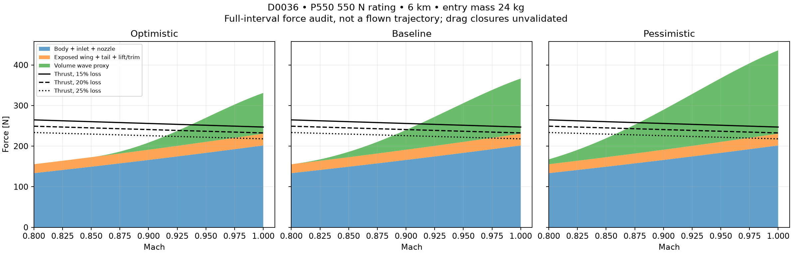
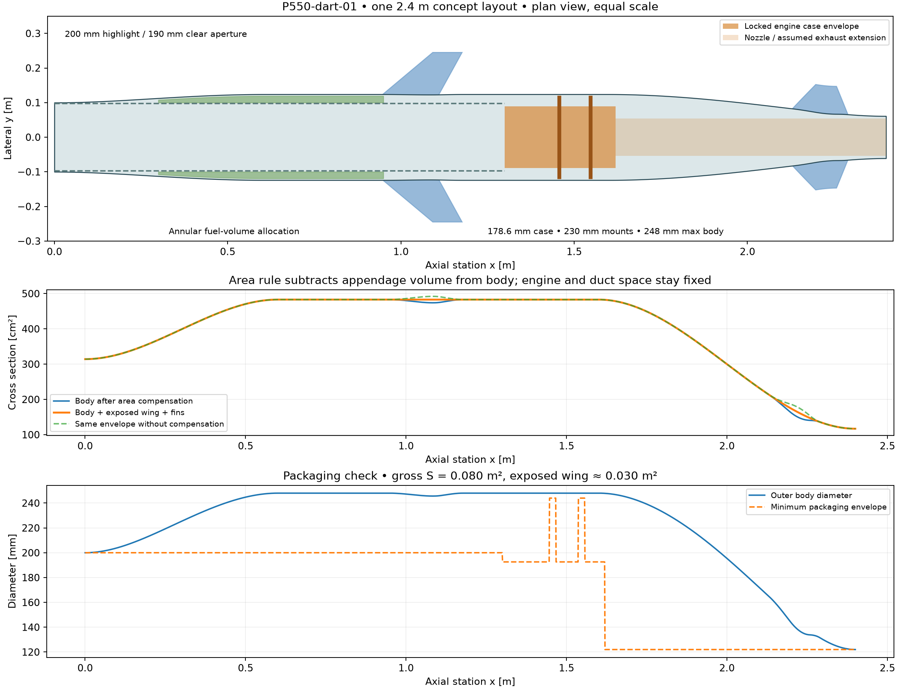

# P550 dart: twelve force-balance cases

**This corner is closed under the declared model: baseline fails at 15% loss on all four masses.**

Only D0027, D0030, D0033 and D0036 were evaluated, at 15%, 20% and 25% total installation loss. One geometry; no design-grid expansion. Optimistic / baseline / pessimistic vary **only the wave term**. Body/inlet/nozzle and exposed-wing/tail drag are identical across those three columns.

## The requested table

Minimum T−D across Mach 0.8–1.0 at 6 km and each case's entry mass, in newtons. Positive means force margin remains; negative blocks a trajectory run. The CSV also records controlling Mach and dry-mass lower-drag bounds.

| ID | Entry mass [kg] | Installation loss | Optimistic wave [N] | Baseline wave [N] | Pessimistic wave [N] |
|---|---:|---:|---:|---:|---:|
| D0027 | 19 | 15% | -82.9 | -118.4 | -187.9 |
| D0027 | 19 | 20% | -97.4 | -132.9 | -202.4 |
| D0027 | 19 | 25% | -112.0 | -147.5 | -216.9 |
| D0030 | 22 | 15% | -83.5 | -119.0 | -188.5 |
| D0030 | 22 | 20% | -98.1 | -133.6 | -203.0 |
| D0030 | 22 | 25% | -112.6 | -148.1 | -217.5 |
| D0033 | 21 | 15% | -83.3 | -118.8 | -188.3 |
| D0033 | 21 | 20% | -97.8 | -133.3 | -202.8 |
| D0033 | 21 | 25% | -112.4 | -147.9 | -217.3 |
| D0036 | 24 | 15% | -84.0 | -119.5 | -189.0 |
| D0036 | 24 | 20% | -98.5 | -134.0 | -203.5 |
| D0036 | 24 | 25% | -113.1 | -148.6 | -218.0 |

**Trajectory runs: 0.** Each wave branch is screened before integration; rejected branches have blank gate/hold simulation outcomes, not invented trajectories. The five-second Mach 1.01 hold remains configured for any qualifying trajectory. See [force table](force_cases.csv) and [trajectory decisions](trajectory_decisions.csv).

## Show the force balance

At Mach 1 and 15% installation loss, baseline wave assumption:

| ID | Fixed body + inlet + nozzle [N] | Exposed wing + tail + lift/trim [N] | Wave from area plot [N] | Installed thrust [N] | Minimum T−D [N] |
|---|---:|---:|---:|---:|---:|
| D0027 | 201.6 | 28.0 | 135.7 | 247.0 | -118.4 |
| D0030 | 201.6 | 28.6 | 135.7 | 247.0 | -119.0 |
| D0033 | 201.6 | 28.4 | 135.7 | 247.0 | -118.8 |
| D0036 | 201.6 | 29.1 | 135.7 | 247.0 | -119.5 |

These are algebraic force audits at constant mass, not flown paths. The dry-mass audit is a generous lower-drag bound; it is not flight with an empty tank. Changing fuel mainly changes induced drag here. It cannot shrink the engine bay, wetted body or inlet.

## Frozen engine and area accounting

- P550-PRO-S: 550 N ISA static, 5.4 kg counted once inside empty mass, SFC 0.144 kg/N/h. Published 1650 ml/min equals 0.022 kg/s at the assumed fuel density 800 kg/m³.
- Conservative case diameter 178.6 mm; product length 419 mm; 427 mm packaging reservation from the linked dimension drawing, with 230 mm mounting hardware. Exact variant interface still needs confirmation.
- Highlight 200 mm, assumed clear aperture 190 mm and duct OD 194 mm. Fixed coefficient reference 0.031416 m²; this is **not** the maximum fuselage frontal area.
- The selected 2.4 m area distribution has 248 mm maximum body diameter (0.04831 m² frontal area), to enclose the mounts. Body wetted area is 1.681 m².
- S remains 0.080 m² gross; exposed wing is 0.0301 m² and exposed fins total 0.0352 m². Buried wing volume is excluded from the area plot.
- Engine package sits at x=1.300–1.727 m. The smooth afterbody assumes a 0.673 m exhaust extension. Its losses are unresolved inside the 15–25% total installation assumption; no extra loss is silently applied.

Area compensation removes exposed wing/fin cross section from body space where packaging allows it. The linear wave-area proxy changes from 0.005510 to 0.004205 m² (23.7% lower). This compares two area plots, not more aircraft performance cases. Station coordinates are in [area_stations.csv](geometry/area_stations.csv).

## Empty mass: budget closure is conditional

Engine 5.4 kg + other allocated equipment 10.8 kg + reserve 1.8 kg = 18 kg empty. The 21 kg budget adds 3 kg reserve. The annular tank volume allocation holds about 4.09 kg using 75% packing and 10% ullage, sufficient for the requested 1 / 3 kg loads. [Explicit allocations](mass_budget.csv).

Only engine mass is sourced hardware data. The remaining masses are allocations, not weighed parts or engineering estimates derived from a structural design. The 18 kg budget closes arithmetically and has not been shown impossible; its IDs are retained here as conditional force-audit rows, **not accepted aircraft candidates**. If a substantiated mass budget exceeds 18 kg, remove D0027 and D0033. Fuel is remaining fuel at transonic entry, not takeoff fuel.

## What this result establishes

The model's force screen closes this particular corner; it does not establish that every possible P550 airplane fails. The body skin-friction estimate uses the actual wetted area, but external pressure drag is still an explicit coefficient assumption. The area-derived wave amplitude uses a linear slender-body functional; open-inlet streamtube, jet plume and transonic shock effects are unresolved. Its Mach ramp and three wave envelopes are assumptions, not validated polars or statistical bounds.

Next work, if resumed, is a slimmer engine bay / better total-area distribution and a defensible inlet/afterbody pressure estimate. **Stop here: no more mass/grid cases or downstream design work.**

## Reproduce

`python -m gypaetus.dart_report --output results/dart` generates the 12 force cases first and integrates only nonnegative branches. Open `notebooks/p550_dart.ipynb` for the same table and figures. `run_inputs.json` records exact inputs, engine map and source hashes; `sha256.json` fingerprints all outputs.

Engine data: [JetCat P550-PRO-S](https://www.jetcat.de/en/productdetails/produkte/jetcat/produkte/Professionell/P550%20PRO-S). Method, uncertainty values and primary references: [model notes](../../docs/dart_geometry.md).
