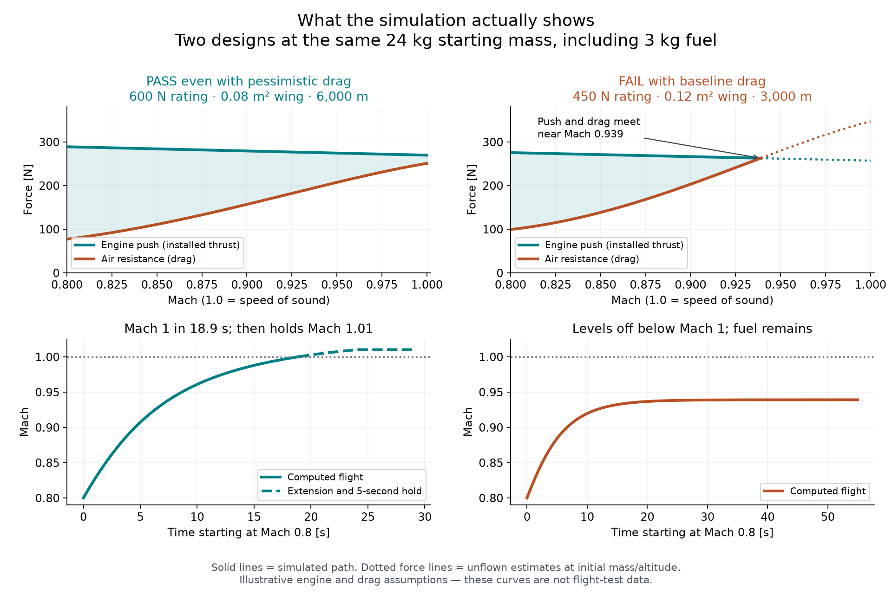

# What worked in the simulation

We tested 108 parameter combinations against three assumed drag curves: 324 runs.
72 runs passed. Four parameter combinations passed all three curves; 28 passed
only the optimistic curve. These are model results, not validated aircraft performance.

The four combinations passing all curves share a 0.08 m² wing, a 600 N sea-level
static bench-thrust rating, and a 6,000 m entry altitude. Their empty/fuel masses
are 18/1, 18/3, 21/1, and 21/3 kg (totals 19, 21, 22, and 24 kg).
The engine, installation and all hardware must fit within the stated empty mass;
this has not been established with an actual engine or airframe.

## Same-weight examples

All rows below start at 24 kg, including 3 kg of fuel, and fly level.

| Engine bench rating | Wing area | Altitude | Optimistic drag | Baseline drag | Pessimistic drag |
| --- | --- | --- | --- | --- | --- |
| 600 N | 0.08 m² | 6,000 m | Pass | Pass | Pass |
| 600 N | 0.08 m² | 3,000 m | Pass | Pass | Fail |
| 450 N | 0.12 m² | 3,000 m | Pass | Fail | Fail |
| 300 N | 0.08 m² | 6,000 m | Pass | Fail | Fail |

No 0.18 m² wing case passed with baseline or pessimistic drag in the tested grid.
Every sea-level case failed: some ran out of acceleration margin; others reached
the assumed dynamic-pressure limit before Mach 1. That structural limit is an
input assumption, not a measured wing-breaking threshold.

## Evidence from two reproduced cases

Left: D0036 with pessimistic drag reaches Mach 1 in 18.93 seconds. Installed thrust
at Mach 1 is 269.44 N, drag is 250.73 N, and the minimum push left for acceleration
through the gate is 18.71 N. It then accelerates to Mach 1.01 and holds that speed
for five seconds, ending with 2.605 kg of fuel. Altitude remains 6,000 m, starting
mass is 24 kg, maximum gate dynamic pressure is 33.05 kPa versus the assumed
65 kPa limit, and required CL remains below the assumed 0.60 bound.

Right: D0059 with baseline drag approaches Mach 0.939. At 54.95 seconds, thrust
and drag are both approximately 262.5 N, leaving only the 0.01 N numerical
acceleration threshold. The run stops below Mach 1 with 2.25 kg of fuel still
available. This is a thrust/drag limitation, not fuel exhaustion. It does not
mean the aircraft automatically dives; it fails the prescribed acceleration gate.

The solid curves show computed flight. Dotted force curves beyond the failed
trajectory are unflown estimates at initial mass and altitude. They are not a
simulation of the failed aircraft somehow reaching Mach 1.

These two cases were rerun and checked against the stored all_cases.csv outcomes
and elapsed times. The package has 30 passing tests, including reference atmosphere
values, fuel conservation, energy balance, failure checks and step-size convergence.
Those tests check the code; they do not validate the assumed engine and drag maps.

All runs start already at Mach 0.8 at the selected altitude. They do not establish
that an aircraft can take off, reach 6,000 m, or enter this acceleration segment
with the specified remaining fuel. Measured propulsion and aerodynamic data,
credible engine/airframe mass, structure, flutter and control validation are still needed.

Files in strongest_pessimistic/ and failed_baseline/ contain exact inputs,
trajectories and check results. same_mass_comparisons.csv contains the full
24 kg comparison. Reproduce this illustration from the project folder with:

    python results/explained/compare_cases.py
