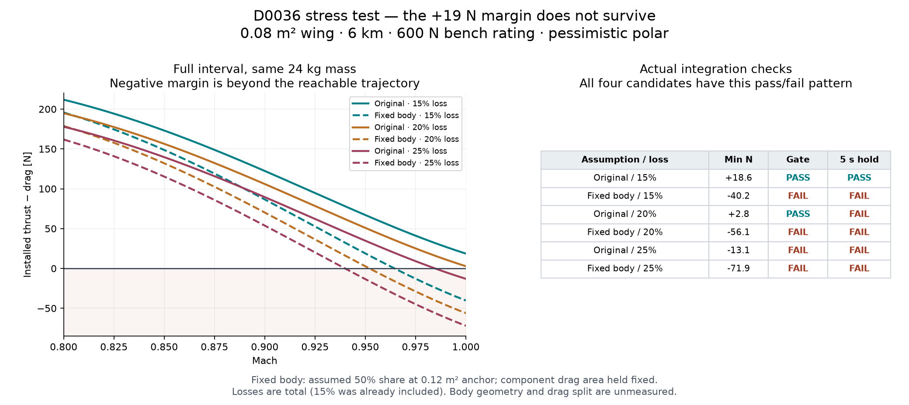

# Four-candidate stress test — no design-grid expansion

**Conservative robustness verdict: feasible only on the assumed polars, not after installation and reference-area consistency.**

This verdict concerns the loss of the original all-three-polar pass: the pessimistic case fails the fixed-body sensitivity at every installation loss tested. The optimistic and baseline cases still pass both gate and hold for all four candidates. This is not proof of universal infeasibility, nor a geometry-calibrated drag prediction.

## Scope

Only D0027, D0030, D0033 and D0036 were rerun. Wing area stays 0.08 m², bench rating 600 N, geometric altitude 6,000 m, flight path level. The original three polar assumptions are retained. Total installation losses are 15%, 20%, 25%. There are 72 targeted evaluations (4 existing designs ×3 polars ×3 losses ×2 area-accounting assumptions); the original grid and its saved results are unchanged.

| Candidate | Empty + fuel mass [kg] | Mass loading [kg/m²] | Entry installed T/W at 15% loss |
| --- | --- | ---: | ---: |
| D0027 | 18 + 1 | 237.5 | 1.549 |
| D0030 | 21 + 1 | 275.0 | 1.338 |
| D0033 | 18 + 3 | 262.5 | 1.402 |
| D0036 | 21 + 3 | 300.0 | 1.227 |

The high-altitude dart description fits this modeled region. Strictly the mass loading spans 237.5–300 kg/m², and the listed T/W values apply at Mach 0.8; they decrease with Mach. Proving a buildable airplane, or reaching the entry altitude/Mach with this remaining fuel, is a later gate.

## Installation accounting

The original model already included 15% loss. The tested multipliers are 0.85, 0.80, 0.75 applied once to the uninstalled altitude/Mach map; they are not another 15–25% multiplied into the existing 0.85. Sea-level static installed thrust is therefore 510, 480, 450 N. At Mach 1 and 6 km it is 269.44, 253.59, 237.74 N. Fuel flow is unchanged by installation loss at fixed throttle.

## Fixed-body sensitivity assumption

No frontal dimensions or component polars were supplied. The explicit assumption is that 50% of parasite and wave drag at the original 0.12 m² anchor reference belongs to body, inlet and external engine geometry. That component's equivalent drag area (Cd×A) and Reynolds length remain fixed when wing area is 0.08 m². The other 50% scales with the wing. Induced drag is still computed from lift and actual wing area; trim CD remains 0.002. The body anchor equivalent chord is sqrt(0.12/3)=0.20 m. This is a controlled sensitivity allocation, not a measured frontal area, and includes no second inlet/ram-drag subtraction from engine net thrust.

```text
D = q × [(1−f) S CD_wing + f S_anchor CD_body] + D_induced + D_trim
CD_on_wing = (1−f) CD_wing + f (S_anchor/S) CD_body + CD_induced + CD_trim
```

Changing reference units alone never changes physical drag. This test changes the assumption that non-wing drag shrinks with the wing. At the anchor geometry it reproduces the original polar, with no added/double-counted body drag. Fixed-body force is tested to remain invariant under changes in wing area and aspect ratio at the same flight condition.

## D0036: pessimistic polar

The original integrated minimum margin was **+18.71 N**. The comparable full-interval entry-mass margins are below. They evaluate the complete Mach 0.8–1 interval at the same 24 kg mass, even when the trajectory cannot reach Mach 1.

| Area accounting | Total installation loss | Minimum entry-mass T−D [N] | Mach 1 gate | Mach 1.01 / 5 s hold |
| --- | ---: | ---: | --- | --- |
| Original area scaling | 15% | +18.65 | Pass | Pass |
| Fixed body, 50% share | 15% | -40.25 | Fail | Fail |
| Original area scaling | 20% | +2.80 | Pass | Fail |
| Fixed body, 50% share | 20% | -56.10 | Fail | Fail |
| Original area scaling | 25% | -13.05 | Fail | Fail |
| Fixed body, 50% share | 25% | -71.95 | Fail | Fail |



With the 50% fixed-body allocation at 15% loss, the negative D0036 bound remains −39.55 N even at empty mass (a deliberately generous lower-drag bound). That bound is not a zero-fuel flight: it asks whether eliminating fuel weight could rescue the force balance. It cannot. Actual failed trajectories stop or time out below Mach 1 and do not continue through the plotted negative full-interval margin. Their sampled minima remain near zero; reporting those as −40 N would be incorrect.

## How little extra drag erases the pass?

For D0036 with the original 15% loss, the entry-mass force margin permits only **0.0005638 m²** of additional equivalent drag area (**5.64 cm² of Cd×A**, not physical frontal area), or **ΔCD = 0.00705** on S=0.08 m². The critical fixed-body share at the stated 0.12 m² anchor is only **15.82%**. This is a force-only threshold. Adequate crossing time, fuel and hold performance must still be tested.

## Five-second hold retained independently

With the original area scaling, all four pass gate and hold at 15% loss. At 20%, all four reach Mach 1 but none completes the extension to the five-second Mach 1.01 hold: the one-kilogram-fuel cases exhaust fuel, and the three-kilogram cases hit the acceleration time limit before the hold starts. At 25%, none reaches Mach 1. The fixed-body pessimistic cases fail the gate at all three losses. Endurance is not forced to equal gate_pass, and a hold that is never reached is not counted as completed.

## Evidence files and reproduction

- `stress_cases.csv`: every targeted outcome; trajectory minima and full-interval bounds have separate columns.
- `force_audits.csv.gz`: Mach-resolved entry-mass and dry-mass bounds; these are not trajectories.
- `break_even_limits.csv`: permissible extra drag area/CD and fixed-body fraction at each loss/polar.
- `cases/`: exact inputs, actual trajectories, hold extensions, flags and terminations.
- `stress_inputs.json`: assumptions and source/dependency identities.
- `notebooks/four_candidate_stress.ipynb`: rerunnable targeted notebook in the project.

```sh
python -m gypaetus.stress --output results/stress
python -m gypaetus.stress_report --output results/stress
python scripts/execute_notebook.py notebooks/four_candidate_stress.ipynb
```
